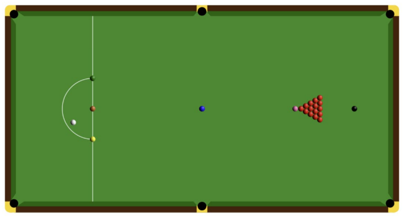

Sure, I'll help you convert the provided text into Markdown. Here's the formatted text:

```markdown
# BSc Computer Science
## CM2030 – Graphics Processing
### Midterm Coursework: A Snooker App

**Introduction:**
During the course so far, we have developed a number of graphics applications using P5js. For this assignment, you are tasked with developing a snooker app. You have to draw the snooker table with pockets, lines etc., add the balls and the cue. A standard full-size snooker table measures 12 ft × 6 ft. Here you choose the size of the table in pixels, but you should maintain the ratio, i.e., length of the table = width of the table / 2.

The ball size is approximately 2 inches in diameter so you could use the formula below:
```markdown
ball diameter = table width / 36.
```
The pocket size should be 1.5 times the size of the ball’s diameter. Use the Snooker wiki ([Snooker Wiki](https://en.wikipedia.org/wiki/Snooker)) for more detailed information so you can complete the table as seen below.



**Task/Steps:**
1. Define your variables for the table, balls, and the cue. Store the balls in appropriate arrays.
2. Draw the snooker table in the middle of the canvas using the correct colors, pockets, and lines as described above.
3. Draw the balls in three modes:
    a. Starting positions
    b. Random positions (reds only)
    c. Random positions (reds and colored balls) - excluding the cue ball
4. Give all balls the necessary physics (for bouncing) and friction (for slowing down). You are expected to use Matter.js.
5. Draw the cue. Options include using the mouse, keyboard, or a combination of them to draw and manipulate the cue so you can hit the cue ball. Adjust the speed of the cue.
6. The cue ball is also inserted using human interaction as above, i.e., use the right combination of key/mouse, etc.
7. Cushions should also have the necessary physics properties for bouncing the balls (different from the ones the balls have). You are expected to use Matter.js.
8. When a red ball is in the pocket, it should be removed from the array.
9. Define a function for collision detection to prompt the user of the type of impact, e.g., cue-red, cue-colour, cue-cushion. The function should work only for collisions of the cue ball.

**Gaming Aspects:**
1. When the cue ball is in the pocket, it should be given back to the player (run step 6 again).
2. If a colored ball falls into the pocket, it should be returned to its original location.
3. If two consecutive colored balls fall into the pocket, then notify the user of this mistake.

**Coding Style:**
1. Code presentation: Use appropriate syntax, comments, consistent indentation, and redundant code.
2. Code competency: Use object orientation, code reusability, use of functions, variables global vs local.

**Extension:**
Since this is a creative module, we would like to give more marks for implementing further ideas. Also, you should write some words about it in the commentary (see next paragraph). Please note that we will award marks for the uniqueness of your extension and how technically challenging it appears to have been. Please note that we will not award any marks if you decide to develop the snooker app with scoring as this is not a unique extension. Try something novel or innovative that has not been seen in snooker gaming before. The extension is worth 20% of your mark.

**Commentary:**
Explain the app design: e.g., why you used a mouse-based only cue function - how does it work? The report quality (i.e. language) will also be assessed. Also discuss your extension and why it is a unique idea. Be precise and deliver the information within 500 words. Include this in your main .js file.

**Video Demo:**
Demonstrate your work using a video. Verbally go through all functionalities and talk about your development decisions. Also talk about your extension. Always have the console window open so any behavior is recorded. We will give zero points to this question if the console is not shown. The video should be up to 5 minutes long.

**General Information:**
You should complete this work using the libs shown in the module. Do not use external code for this assignment. All your code and commentary will be checked for plagiarism/AI generation.

**Submission Requirements:**
1. Compress all your code in .ZIP format and upload it in the first prompt.
2. Upload the video demo in .mp4 format in the second prompt.
3. Use an alternative video submission link to upload the video demo to YouTube or similar, then submit the URL only in the third prompt.
4. Merge all your .js code into a single file, then upload it in the last prompt. Use the JavaScript Bundler Tool (see previous learning item) to merge all your .js files into a single .txt file. Exclude any libraries you used such as p5.js, Matter.js, etc. This is a submission requirement as we need this to run your code.


