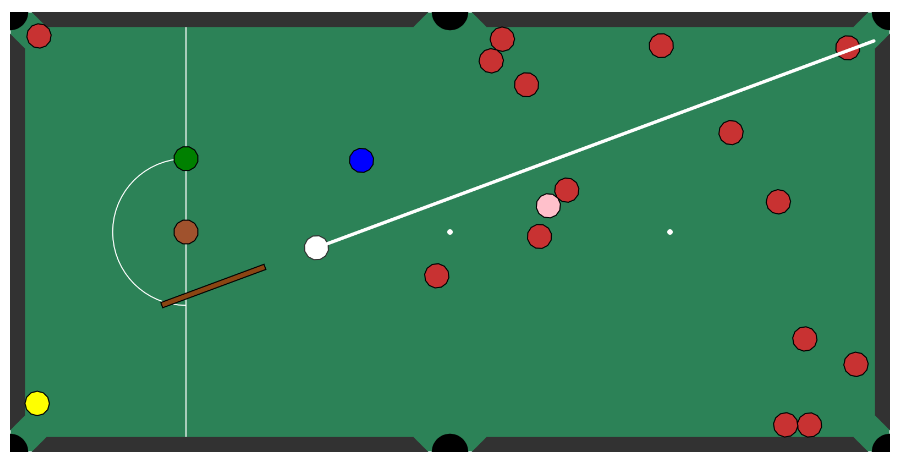

# BSc Computer Science
## CM2030 – Graphics Processing
### Midterm Coursework: A Snooker App

# Snooker Game
Play the game [here](https://pavelosky.github.io/Snooker-GP-Midterm-project/)



## Overview
This project is a simple snooker game implemented using JavaScript and the Matter.js physics engine. The game features two modes: **Normal** and **Random**. In **Normal** mode, the balls are placed in their correct positions, while in **Random** mode, the red balls are placed randomly, but the colored balls remain in their correct positions. The game is controlled using the mouse, and the cue ball can be hit by clicking and dragging the mouse.

## Features
- **Two Game Modes**: Normal and Random.
- **Cue Ball and Cue**: The cue revolves around the cue ball and follows the mouse movement. The strength of the hit is determined by the distance between the mouse pointer and the cue ball.
- **Physics Simulation**: All objects (balls, cue ball, cushions) are added to the physics engine and reflect real-world behavior.
- **Ball Removal**: Red balls are removed from the array and the world when they fall into the pocket.

## Setup
1. **Include Matter.js**: The game uses the Matter.js library for physics simulation. Include the following CDN in your HTML file:
   ```html
   <script src="https://cdnjs.cloudflare.com/ajax/libs/matter-js/0.14.2/matter.min.js"></script>
   ```

2. **Create a Canvas**: The game is drawn on an HTML canvas. Ensure you have a canvas element in your HTML file:
   ```html
   <canvas id="snookerCanvas"></canvas>
   ```

3. **Link the JavaScript File**: Link the `sketch.js` file in your HTML file:
   ```html
   <script src="sketch.js"></script>
   ```

## How to Play
1. **Start the Game**: Open the HTML file in a web browser. You will see a start screen with two options: **Normal** and **Random**.
2. **Select a Mode**: Click on the left side of the canvas to select **Normal** mode or the right side to select **Random** mode.
3. **Control the Cue**: Move the mouse to control the direction of the cue. Click and drag the mouse to hit the cue ball. The strength of the hit is determined by the distance between the mouse pointer and the cue ball.
4. **Pocket the Balls**: The goal is to pocket the red balls. When a red ball falls into a pocket, it is removed from the game.

## Code Structure
- `setup()`: Initializes the game, creates the canvas, and sets up the physics engine.
- `draw()`: The main game loop that updates the physics engine and draws the game elements.
- `mousePressed()`: Handles mouse click events to start the game and hit the cue ball.
- `Ball Class`: Defines the `Ball` class used to create ball objects.
- `generateBalls()`: Function to create new balls and add them to the game.
- `isInPocket()`: Function to check if a ball is in a pocket.
- `drawVertices()`: Helper function to draw the vertices of the game objects.

## Room for Improvement
- **Code Organization**: The code should be split into separate files for better organization and readability.
- **Comments**: More comments should be added to explain the purpose of the code.
- **Additional Features**: Implement additional game modes and features to enhance the gameplay experience.

## Summary
This project is a simple snooker game that demonstrates the use of the Matter.js physics engine in a JavaScript application. While there are areas for improvement, the game provides a solid foundation for further development and enhancement.


